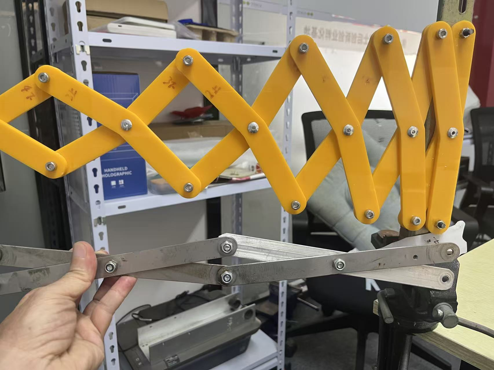
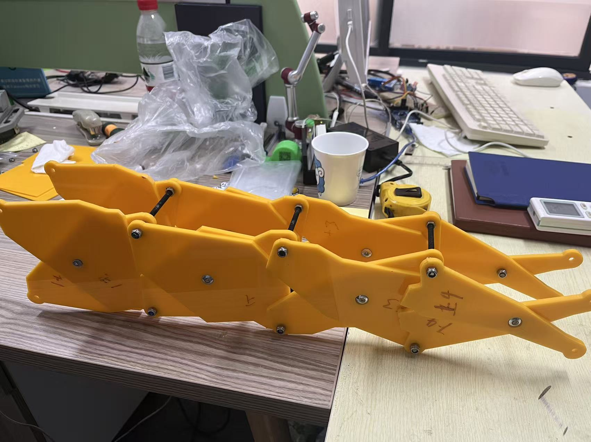

" Manipulator: The Non-Linear Scissor Arm"

Success! This achievement resolves the long-standing structural challenge—a puzzle that has persisted for two centuries—regarding the structural collapse of scissor arms during horizontal extension. As illustrated, the base footprint of a traditional scissor arm narrows as it extends horizontally; in contrast, the innovative non-linear scissor arm maintains a fixed, unchanging base width during horizontal extension! This problem could not be solved through empirical experimentation or data-driven analysis alone. For instance, this specific arm configuration features a double-row design comprising 28 individual links, each with one of seven distinct bending angles, and each capable of 360-degree rotational adjustment. This results in a parameter space of 360^35—a number exceeding the total number of atoms on Earth! Consequently, it is impossible to derive a solution through exhaustive empirical testing, nor can it be solved using big data, deep learning, or reinforcement learning techniques. The reason is that the massive datasets required for this specific non-linear scissor arm project simply do not yet exist anywhere in the world; the only available data pertains to *linear* scissor arms—such as those found in construction scissor lifts—which are strictly limited to simple, linear rod geometries. Therefore, the solution could only be achieved through intelligent algorithms; specifically, we employed our proprietary topology-based *SmartCon* algorithm, augmented by methods derived from graph theory. The gratifying result is that we not only identified the optimal structural solution for this specific 15-degree conical-angle arm, but we also successfully discovered the optimal structural solutions for *all* conical-angle arms within the range of 0° < α < 180°.

So, what is the practical utility of this invention? Its applications are immense! Fundamentally, it transforms the high-order non-linear equations governing a robot's forward and inverse kinematics into linear equations. This yields a host of advantages: a ninefold increase in computational efficiency, a streamlined control system that bypasses the need for expensive precision reducers, a simplified manipulator structure, a tenfold reduction in operational energy consumption, a threefold expansion of the arm's working reach, and a 50% reduction in manufacturing costs.
This innovation now serves to break the existing bottleneck hindering AI's interface with the physical world. The eight aforementioned optimizations in robot design represent a direct, cost-effective pathway forward—one that also facilitates the acquisition of high-quality robotic data. Indeed, the quality of robotic data currently available is, by and large, quite poor.

