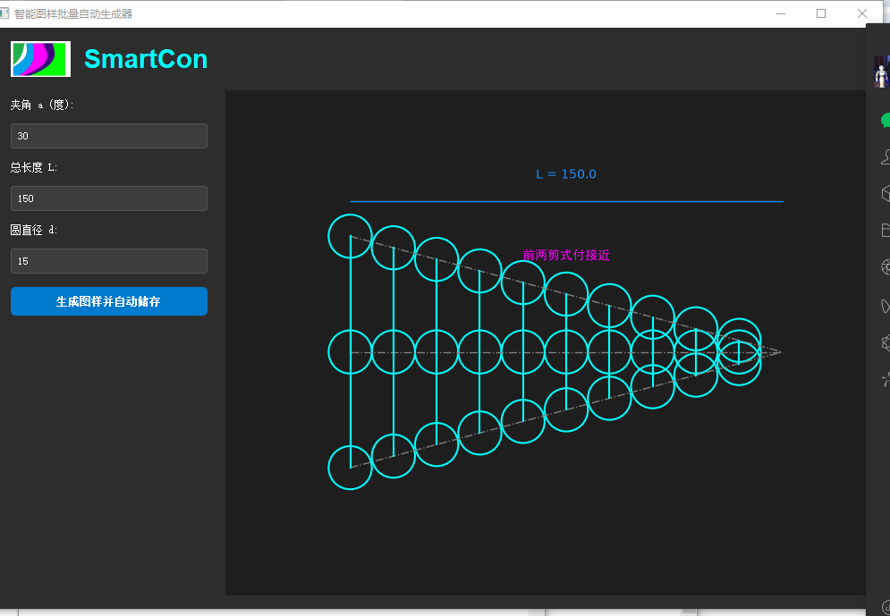
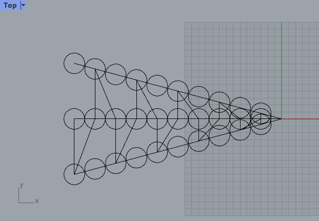

From CAD to a Robot Morphology Generation Engine

Today marks an important milestone for our robot design platform.

Our SmartCon software can now automatically generate editable robot body geometries from a small set of design parameters.
(See the figure below.)
Designing a robot body has traditionally been an iterative and labor-intensive engineering process. Every geometric modification requires manual CAD modeling, repeated validation, and continuous re[...]

As additional parameters are introduced, the design space expands exponentially.
