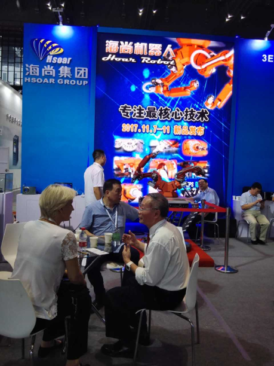
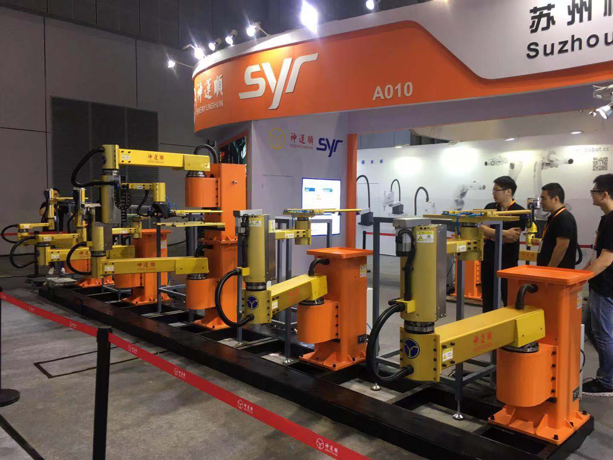

The Structural Disease of Serial Robots

The fundamental limitation of conventional industrial robots is not only control, sensing, or AI.
It is physical architecture.
In a traditional serial-link robot, large motors and gearboxes are mounted directly on single-link arm segments. Each upstream joint must not only move its own link, but also carry and accelerate every downstream link, motor, gearbox, cable, and end-effector.
This creates a cascading amplification effect.
A larger downstream actuator increases the load on the upstream actuator. The upstream actuator must then become larger, which further increases the total mass and inertia of the robot. As reach increases, the system enters a compounding cycle of weight, inertia, power consumption, heat generation, and structural cost.
In many conventional long-reach robots, the first-stage actuator may need to be several times larger than the downstream actuator. The second-stage actuator must again account for the accumulated mass and inertia of all downstream components.
This is not merely a motor-sizing problem.
It is an architectural problem.
Smart Line Robotics begins from a different premise:
Physical AI cannot be built only by attaching smarter software to old mechanical bodies Robots with a serial structure, also known as traditional industrial robots, have been in use for 72 years since 1954.
It requires new physical architectures designed for reach, efficiency, scalability, and intelligence from the beginning.

