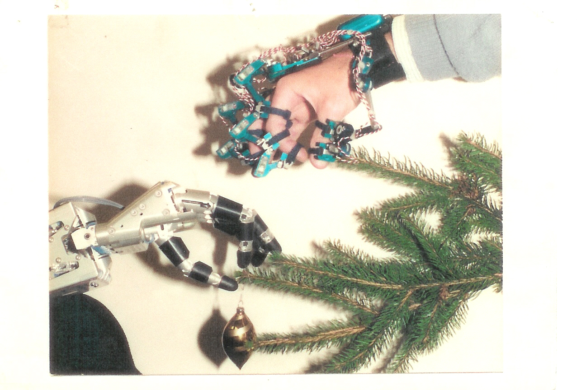
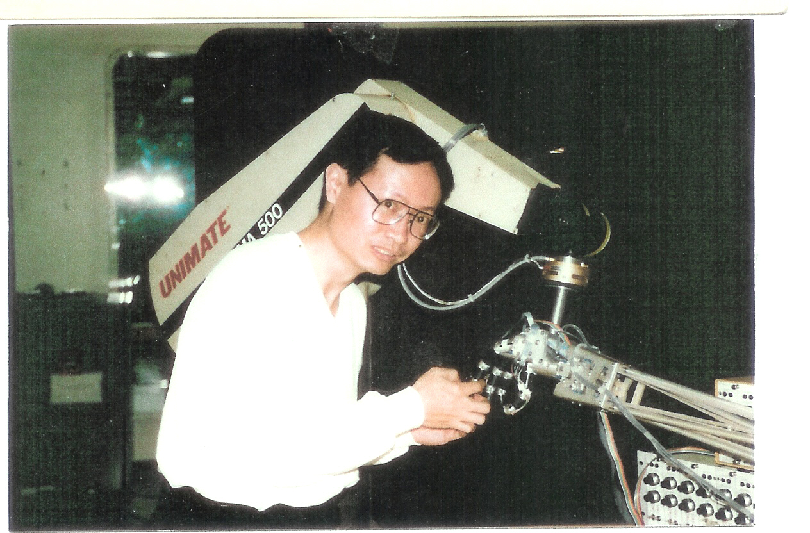

Thirty Years of Building Toward Physical AI

Thirty years ago, I was building force-sensing robotic hands at NYU. At the time, few people imagined that robots would one day become the physical interface of artificial intelligence. Looking back today, I realize those early experiments were not isolated research projects—they were the beginning of a journey that has now evolved into what I call the Physical Architecture of AI.

    
During my doctoral research at the Robotics Laboratory of NYU's Courant Institute, I worked on one of the earliest research platforms for dexterous robotic manipulation.
The robotic hand hardware was developed at the University of Utah, while the control software originated at MIT. My responsibility was to redesign the fingertips by integrating miniature three-axis force sensors into the thumb, index finger, and middle finger. Rather than simply attaching sensors, I reconstructed the distal phalanges themselves—the sensor became part of the finger's mechanical structure, together with a fingertip mount and a compliant skin sleeve.

Each sensing unit consisted of three hollow square-section flexural columns. The first column was oriented perpendicular to the other two, and pairs of strain gauges were bonded to the columns to form Wheatstone bridge circuits. This configuration enabled simultaneous measurement of multi-axis contact forces during grasping. Combined with appropriate control algorithms, the robot could regulate gripping force and even estimate the weight of an object, such as the amount of water contained in a cup.

That research formed only one part of my doctoral work. At the same time, I also designed and built three four-axis direct-drive robots from the ground up.
Looking back after three decades, I realize that many of the engineering challenges we were addressing then—high-performance force sensing, compliant manipulation, lightweight robot structures, and intelligent control—have become central themes once again in today's era of Physical AI.

Today, our company has developed six-axis force sensors, a family of nonlinear topological robotic arms, the SmartCon robot-body generation platform, and a portfolio of more than 200 patents. Rather than isolated inventions, these technologies represent three decades of continuous exploration toward a new physical architecture for intelligent machines.

Artificial Intelligence is advancing at extraordinary speed. What remains to be reinvented is the robot body itself. I believe the next generation of world-class robots will emerge not only from better AI models, but from fundamentally new physical architectures designed specifically for the Physical AI era.

Looking back, I don't see thirty years of separate projects. I see one continuous journey—from robotic sensing, to robot bodies, to the Physical Architecture of AI. Perhaps some ideas simply need the right era before the world is ready for them.
