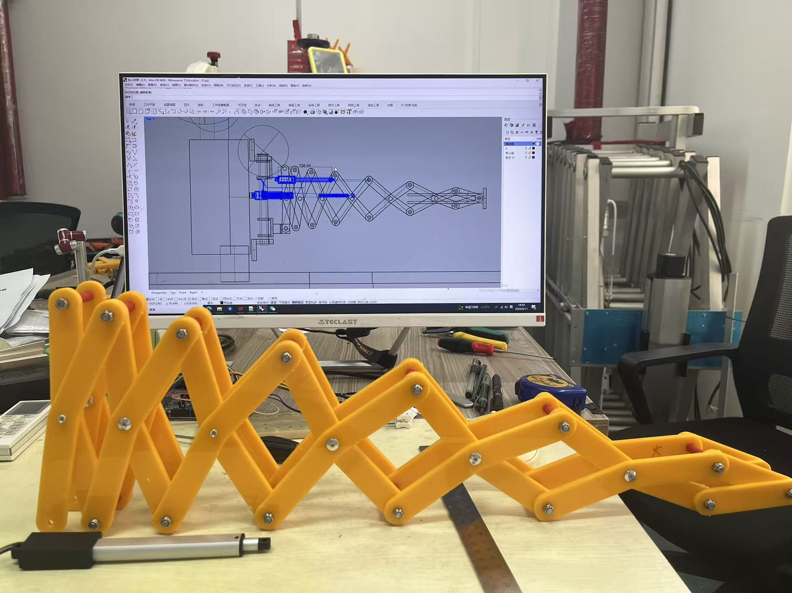
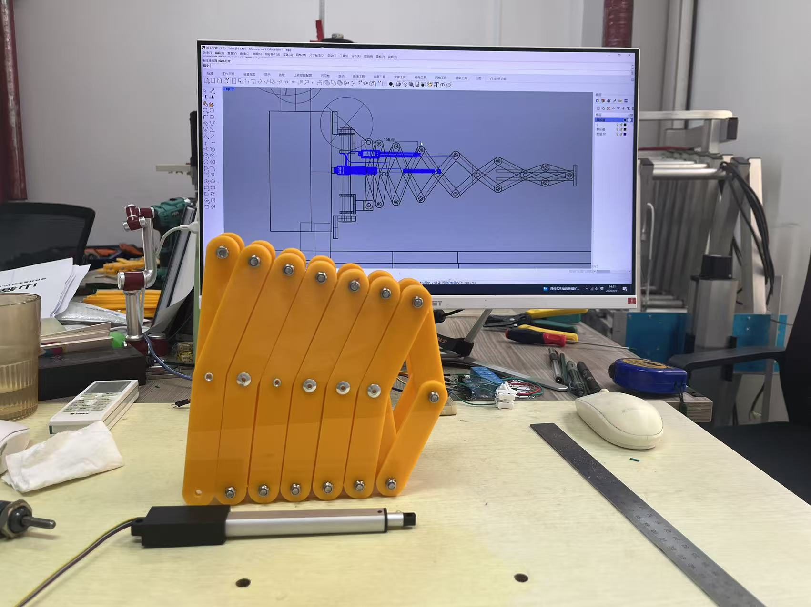
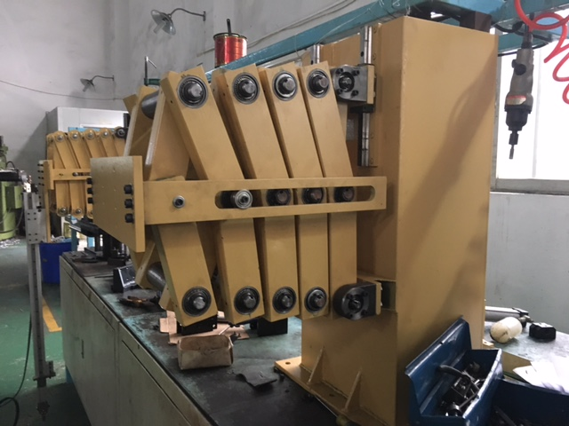

We have solved a structural mechanics conjecture that had stumped the field for 120 years; robots no longer require precision speed reducers. Costs are halved, 
energy consumption drops by 90%,and heat generation is eliminated. Kinematic and inverse kinematic models have been optimized from 18th-order to 5th-order, 
resulting in a 3.5-fold increase in control response speed and a threefold reduction in memory usage. Don't you agree? Let's build a robot application and see for ourselves!

